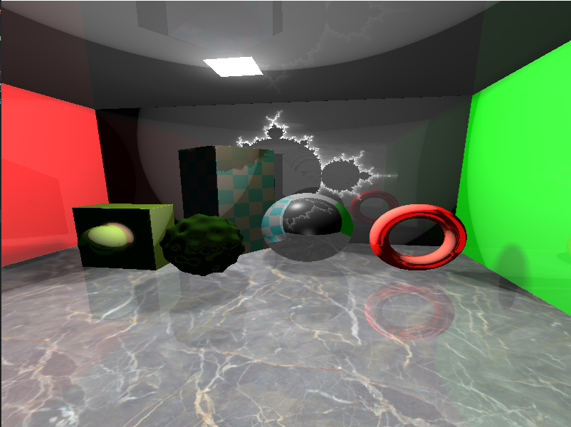

## Tampere University Computer Graphics project
##### The following Scene is implemented using Ray Marching

1) Features Implemented are listed in SceneRenderer.fs

2) Prebuilt debug exe can be found under x64\Debug folder:

3) This project requires the following libraries and all libraries have been included in 'required libraries' folder

GLM: To add this, open project settings -> C/C++ -> General: add the path to glm in 'Additional include directories'
Example Path: C:\Users\karim\Downloads\glm-0.9.9.8\glm\

GLAD: added under additional include directories like GLM 
Example Path: C:\Users\karim\Downloads\glad\include

GLFW: also to be added under additional include directories:
Example Path: C:\Users\karim\Downloads\glfw-3.3.2.bin.WIN64\glfw-3.3.2.bin.WIN64\include

